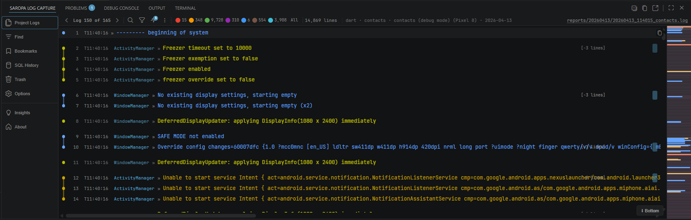
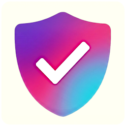
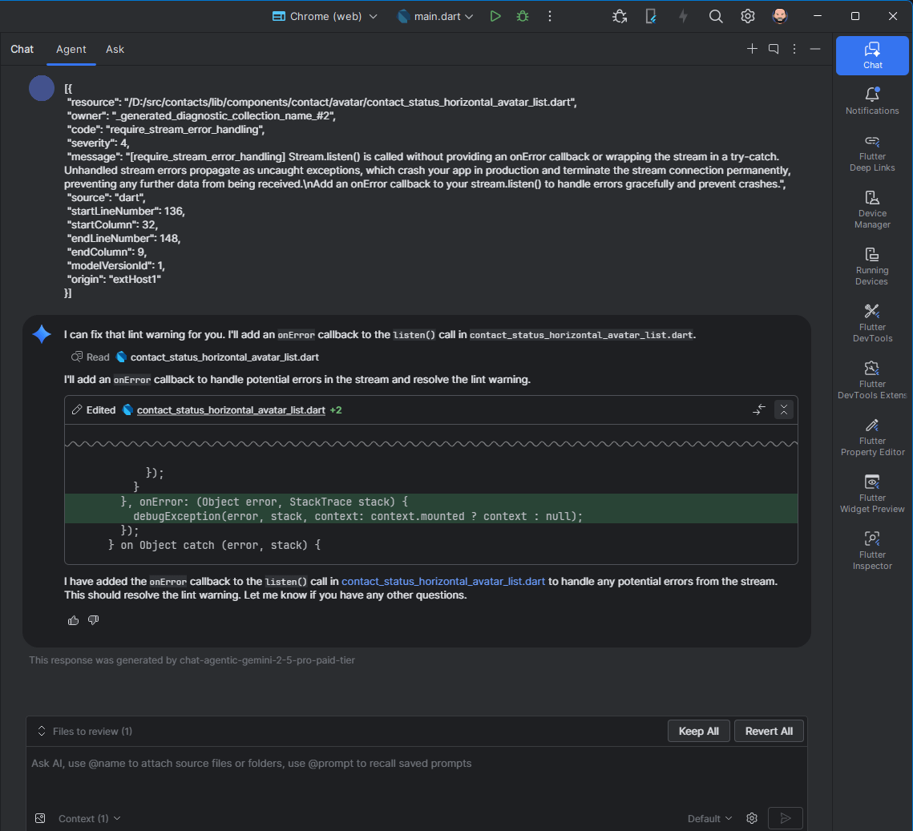

# Saropa Suite

One-click install for the full Saropa developer toolkit. **Saropa Suite** bundles three powerful VS Code extensions to fortify your Flutter and Dart development workflow, providing persistent logging, strict behavioral analysis, and comprehensive local database diagnostics.

---

## ⚡ Suite Integrations: Better Together

Installing the full Saropa Suite unlocks native, cross-extension APIs that dramatically speed up your workflow:

* **Log Capture + Lints:** Exported bug reports become actually useful. Log Capture natively cross-references runtime errors with static analysis findings. It embeds lint violations (filtered by impact), OWASP executive summaries, and overall project health scores directly into your logs. Stale lint data is automatically refreshed before report generation.
* **Log Capture + Drift Advisor:** Your debugging sessions now carry deep database context. Session metadata bundles query performance stats, schema summaries, anomaly counts, and index suggestions. Right-click any SQL line in your logs to instantly "Open in Drift Advisor" to profile and optimize the query. Root-cause log hints will actively reference Drift database issues.

```
                     ┌───────────────────┐
                     │   SAROPA  SUITE   │
                     └─────────┬─────────┘
               ┌───────────────┴───────────────┐
               │                               │
  ┌────────────┴─────────────┐   ┌─────────────┴────────────┐
  │       Saropa Lints       │   │   Saropa Drift Advisor   │
  │                          │   │                          │
  │  Static Behavioral &     │   │  Local DB Analysis &     │
  │  Security Analysis       │   │  Query Profiling         │
  └────────────┬─────────────┘   └─────────────┬────────────┘
               │                               │
               │  Injects OWASP summaries,     │  Syncs SQL stats
               │  health scores, and lint      │  context.
               │  violations.                  │
               │                               │
  ┌────────────┴───────────────────────────────┴─────────────┐
  │                   Saropa Log Capture                     │
  │         Persistent Runtime Logging & Navigation          │
  └──────────────────────────┬───────────────────────────────┘
                             │
                             │  Generates
                             │
                  ┌──────────┴──────────────────────────┐
                  │  Context-Rich Exported Bug Reports  │
                  └─────────────────────────────────────┘
```

---

## 🛠️ What's Included

###  [Saropa Log Capture](https://marketplace.visualstudio.com/items?itemName=saropa.saropa-log-capture)
**Intelligent, Persistent Logging:** The Debug Console is deleted the moment you stop debugging — Log Capture fixes that. It automatically saves all debug session output to persistent, searchable log files and provides a full diagnostic workstation inside VS Code.

- **Zero-config capture** — works with any debug adapter (Dart, Flutter, Node, Python, C++, Go, Java). Install, press F5, done.
- **Virtual-scrolling viewer** — handles 100K+ lines without lag, with real-time severity filtering across 8 levels, regex search with history, and click-to-source navigation.
- **Smart error classification** — auto-classifies errors (CRITICAL, TRANSIENT, BUG) with inline badges, fingerprints recurring patterns across sessions, and detects ANR risk, N+1 queries, and slow operations.
- **Unified signal analysis** — aggregates errors, warnings, performance, SQL, network, and memory signals across sessions with trend tracking (↑ stable ↓), co-occurrence detection, and evidence-backed reports with surrounding context.
- **SQL diagnostics** — query fingerprinting, N+1 detection, slow query burst markers, and cross-session SQL comparison with Drift ORM support.
- **Session management** — side-by-side session comparison, session replay with scrubber/speed controls, deep links (vscode:// URLs), active case investigations, and collapsible daily groupings.
- **Rich export** — HTML (static or interactive), CSV, JSON, JSONL, shareable `.slc` bundles, Grafana Loki push, and markdown with full metadata. Per-level export presets (Errors Only, Production Ready, Full Debug, Performance Analysis).
- **20+ integration adapters** — opt-in session context from Git state, test results, code coverage, crash dumps, Docker, performance snapshots, terminal output, HTTP/network, browser DevTools, and more.




###  [Saropa Lints](https://marketplace.visualstudio.com/items?itemName=saropa.saropa-lints)
**Strict Behavioral Analysis:** 2,100+ custom lint rules and 250+ quick fixes that go far beyond syntax — catching the runtime errors, memory leaks, and security vulnerabilities that standard linters miss entirely.

- **Behavioral detection** — catches code that compiles but fails at runtime: undisposed controllers, `setState` after dispose, `GlobalKey` recreation, hardcoded credentials. Uses proper AST type checking, not string matching.
- **Library-specific audits** — 50+ rules per popular package (GetX, Riverpod, Bloc, Provider, Firebase, Isar, Hive, Dio, GraphQL, Supabase, Flutter Hooks, and more) targeting anti-patterns unique to each library.
- **OWASP-mapped security** — 60+ rules across all 10 OWASP Mobile Top 10 (2024) categories with compliance export for security audits. Covers hardcoded credentials, unsafe deserialization, insecure HTTP, weak cryptography, and injection vulnerabilities.
- **5-tier adoption system** — Essential (~300 rules) → Recommended (~950) → Professional (~1800) → Comprehensive (~1870) → Pedantic (~1880), with baseline mode for legacy codebases. Adopt gradually without fixing all existing violations.
- **Platform & accessibility rules** — 90+ iOS-specific rules (Safe Area, Privacy Manifest, Face ID, HealthKit), 11+ Android rules, macOS/Web/Desktop rules, and EAA (European Accessibility Act) compliance checks.
- **Package Vibrancy scoring** — dependency health scanning with ecosystem adoption metrics, replacement complexity analysis, file usage tracking, GitHub issues/PRs counts, README galleries, and version-gap PR triage.
- **VS Code dashboard** — health score (0–100), issues tree grouped by severity/file/rule, OWASP coverage matrix, file risk rankings, rule triage UI, score trends over time, and a searchable catalog of 117+ commands.
- **AI-optimized diagnostics** — every diagnostic is formatted as a paste-ready AI repair prompt for Cursor, Copilot, and Windsurf.
- **Cross-file CLI** — detect unused files, circular imports, and generate import graphs (DOT format for Graphviz).




###  [Saropa Drift Advisor](https://marketplace.visualstudio.com/items?itemName=saropa.drift-viewer)
**Deep SQLite/Drift Debugging:** A two-client debug platform — a lightweight HTTP server in your app (zero third-party runtime dependencies) paired with both a browser UI and a VS Code extension. Not just a table viewer; a complete database diagnostic suite.

- **Data browsing** — multi-table tabs with foreign key navigation and breadcrumb trails, PII masking (50+ column patterns), data type toggle (raw SQLite ↔ human-readable), and one-click cell copy.
- **Query tools** — SQL runner with autocomplete and 200-entry history, visual query builder (SELECT/WHERE/ORDER BY/LIMIT), natural language "Ask in English" → SQL, multi-statement **SQL Notebook**, and color-coded **EXPLAIN panel** with index suggestions.
- **Data visualization** — bar, stacked bar, pie, line, area, scatter, and histogram charts from SQL results with PNG/SVG export.
- **Data quality** — anomaly detection (NULLs, orphaned FKs, duplicates, numeric outliers with severity), health score (0–100 with letter grade A–F), index suggestions with ready-to-use SQL, and storage analytics with table sizes and journal mode.
- **Schema intelligence** — live schema SQL, ER diagrams with FK relationship lines, schema diff (code-defined vs runtime), offline Dart workspace scanning for Drift `Table` classes, Isar-to-Drift converter, migration preview/codegen, and rollback generator.
- **Time travel** — snapshots with diff comparison and export, timeline auto-capture on data change, database comparison (schema match, row counts, migration DDL), row comparator, and query regression detection across sessions.
- **Performance profiling** — query execution times, slow-query detection (configurable threshold), mutation stream with real-time INSERT/UPDATE/DELETE feed, and watch panel with live polling and diff highlighting.
- **Collaboration** — shareable session URLs with annotations and expiry, portable self-contained HTML reports, CSV/JSON/SQL dumps, and raw `.db` download.
- **Security** — default read-only posture (writes require explicit callback), bearer token or HTTP Basic auth, CORS control, rate limiting, loopback-only binding, and session TTL.
- **Four themes** — Light, Showcase (glassmorphism with animated gradients), Dark, and Midnight (deep navy with aurora glow), with OS dark-mode sync.


---

## 🚀 Getting Started

1. Install **Saropa Suite** from the [VS Code Marketplace](https://marketplace.visualstudio.com/items?itemName=saropa.saropa-suite).
2. All three extensions are installed and activated automatically.
3. No configuration required — each extension works out of the box.

---

## 💬 Contact & License

**Email:** [saropa.suite@saropa.com](mailto:saropa.suite@saropa.com)  
**License:** [MIT](LICENSE)