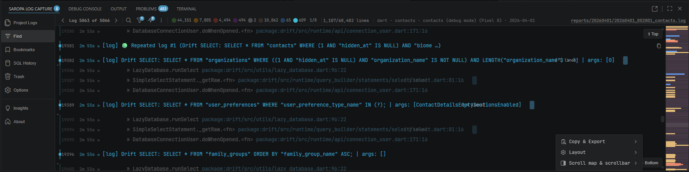
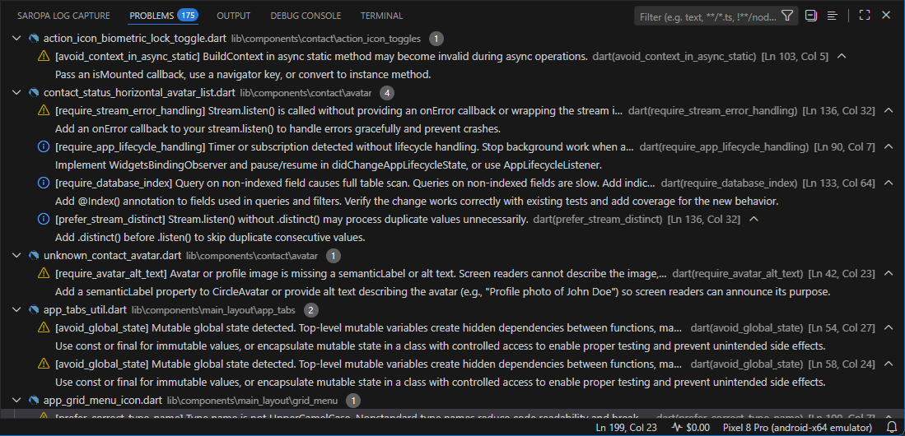

# Saropa Suite

One-click install for the full Saropa developer toolkit.

## Included extensions

| Extension | What it does |
|---|---|
| **[Saropa Log Capture](https://marketplace.visualstudio.com/items?itemName=saropa.saropa-log-capture)** | Automatically saves Debug Console output to persistent, searchable log files. Virtual-scrolling viewer, error intelligence, signals, SQL diagnostics, session comparison, and export. |
| **[Saropa Lints](https://marketplace.visualstudio.com/items?itemName=saropa.saropa-lints)** | 1700+ custom Dart and Flutter lint rules. Catches memory leaks, OWASP-mapped security vulnerabilities, and runtime crashes. AI-ready diagnostics for faster repairs. |
| **[Saropa Drift Advisor](https://marketplace.visualstudio.com/items?itemName=saropa.drift-viewer)** | Schema health, query performance, index suggestions, and anomaly detection for Drift (SQLite) databases. |

## Screenshots

### Saropa Log Capture

### Saropa Lints

### Saropa Drift Advisor

## Why install the pack?

Each extension works well standalone, but they unlock deeper integration when installed together:

- **Log Capture + Lints** — Bug reports include lint violations filtered by impact, OWASP executive summaries, health scores, and one-click "Explain Rule" links. Stale lint data is refreshed automatically before report generation.
- **Log Capture + Drift Advisor** — Session metadata and sidecar files carry query performance stats, schema summaries, anomaly counts, index suggestions, and diagnostic issues. Right-click SQL lines for "Open in Drift Advisor". Root-cause hints reference Drift issues.

## Getting started

1. Install **Saropa Suite** from the [VS Code Marketplace](https://marketplace.visualstudio.com/items?itemName=saropa.saropa-suite).
2. All three extensions are installed and activated automatically.
3. No configuration required — each extension works out of the box.

## Contact

**Email:** [saropa.suite@saropa.com](mailto:saropa.suite@saropa.com)

## License

[MIT](LICENSE)
